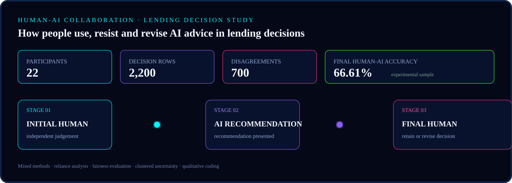
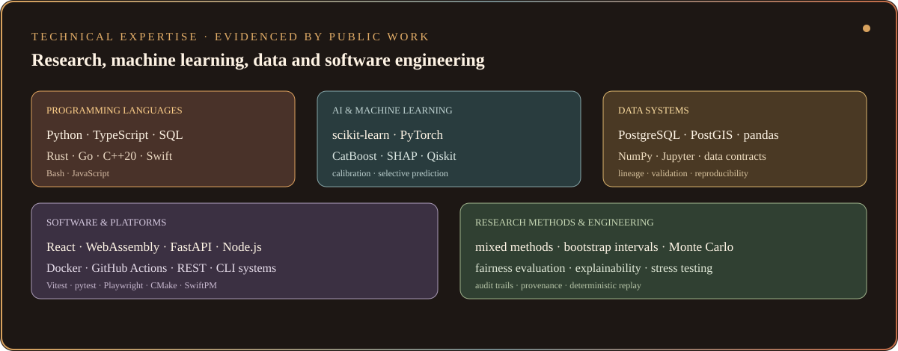
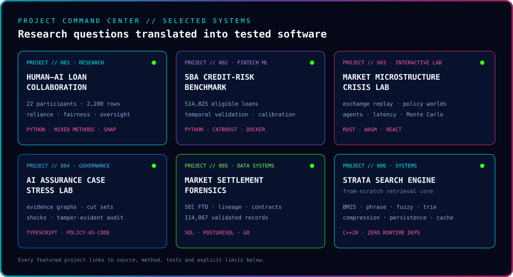
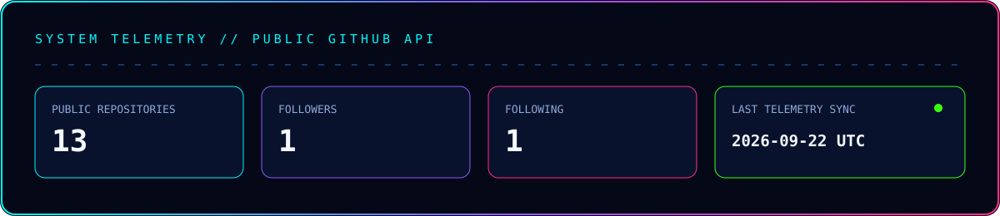
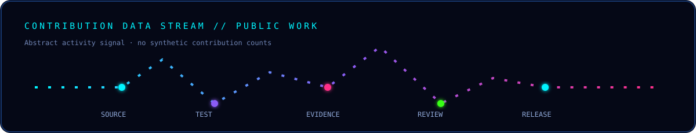

<div align="center">




<sub><code>RESPONSIBLE AI</code> · <code>MACHINE LEARNING</code> · <code>FINANCIAL SYSTEMS</code> · <code>RESEARCH SOFTWARE</code></sub>

</div>

<div style="font-family: 'Times New Roman', Times, serif;">

```console
jithu@neural-core:~$ whoami
AI researcher and engineer building rigorous machine-learning systems,
financial intelligence tools, data infrastructure and research software.

jithu@neural-core:~$ operating_principle
Engineer with evidence. Validate with discipline. Communicate with clarity.
```


## Neural Profile

I work at the intersection of **research, engineering and decision intelligence**, transforming complex questions into systems that can be tested, inspected and improved. My work combines disciplined experimentation with practical software engineering, from defining data boundaries and building models to evaluating uncertainty and documenting reproducible evidence.

My current focus spans:

- **Responsible AI:** Human oversight, appropriate reliance, fairness, explainability and AI assurance.
- **Machine Learning:** Temporal validation, calibration, model comparison, selective prediction and uncertainty estimation.
- **Financial Technology:** Credit risk, market microstructure, settlement data and intelligent decision support.
- **Software Systems:** Search, simulation, data pipelines, interactive research interfaces and reproducible tooling.

Across these areas, I focus on one principle: advanced systems should remain **transparent, testable and useful in real decision environments**.

<br clear="right" />


## Research Node // Human ↔ AI

[](https://github.com/JithuVathiath/human-ai-loan-collaboration-analysis)

My Warwick research investigated how people interpret, resist and revise algorithmic recommendations during lending decisions. The study followed a three-stage decision process: an independent human judgement, an AI recommendation, and a final human decision. Quantitative decision-flow analysis was combined with qualitative evidence to examine reliance, accuracy, fairness and human oversight.

The public repository deliberately separates empirical evidence from broader deployment claims. Findings are reported within the boundaries of the experimental sample, predictive explanations are distinguished from causal explanations, and descriptive group differences are not presented as legal fairness determinations.

**Research Signals:** 22 participants · 2,200 decision rows · 700 initial human-AI disagreements · 60% appropriately resolved disagreements · 66.61% final human-AI accuracy.

[Explore The Research Repository →](https://github.com/JithuVathiath/human-ai-loan-collaboration-analysis)


## Technical Arsenal



This stack reflects technologies demonstrated across my public research, data, AI and systems repositories rather than a generic list of tools.


## Project Command Center



### Flagship Systems

1. **[Human-AI Loan Collaboration Analysis](https://github.com/JithuVathiath/human-ai-loan-collaboration-analysis)**  
   Mixed-methods Responsible AI research examining reliance, accuracy, group outcomes and human oversight in AI-assisted lending decisions. `Python` `Jupyter` `CatBoost` `SHAP`

2. **[SBA 7(a) Credit-Risk ML Benchmark](https://github.com/JithuVathiath/credit-risk-ml-benchmark)**  
   A leakage-controlled, future-vintage credit-risk benchmark covering 514,825 eligible loans, with calibrated probabilities, drift analysis and explicit decision-cost evaluation. `Python` `scikit-learn` `CatBoost` `Docker`

3. **[Market Microstructure Crisis & Governance Lab](https://github.com/JithuVathiath/market-microstructure-crisis-lab)** · **[Launch Lab](https://jithuvathiath.github.io/market-microstructure-crisis-lab/)**  
   A deterministic browser-based laboratory for exchange design, heterogeneous trading agents, latency, crisis replay and paired policy experiments. `Rust` `WebAssembly` `TypeScript` `React`

4. **[AI Assurance Case Stress Lab](https://github.com/JithuVathiath/ai-assurance-case-stress-lab)**  
   Policy-as-code infrastructure that connects assurance claims to evidence, stress-tests approvals under governance shocks, discovers minimal cut sets and records tamper-evident decisions. `TypeScript` `Node.js` `SARIF` `SHA-256`

5. **[SQL Market Settlement Forensics](https://github.com/JithuVathiath/sql-market-settlement-forensics)**  
   Audit-ready ingestion and warehouse analytics for SEC fails-to-deliver data, with lineage tracking, data-quality contracts and measured access-path experiments. `PostgreSQL` `SQL` `Go` `Docker`

6. **[Strata Search Engine](https://github.com/JithuVathiath/strata-search-engine)**  
   A dependency-free C++20 retrieval engine featuring compressed positional indexes, BM25 ranking, phrase, prefix and fuzzy search, persistence and reproducible benchmarks. `C++20` `BM25` `BK-tree` `LRU`

<details>
<summary><strong>Additional Research Systems</strong></summary>
<br />

- **[Supply Network Resilience Lab](https://github.com/JithuVathiath/supply-network-resilience-lab)** - Swift 6 network-flow and correlated Monte Carlo laboratory for CVaR, N-2 criticality and resilience-investment search.
- **[Quantum-Enhanced Heart Disease Ensemble](https://github.com/JithuVathiath/quantum-heart-disease-ensemble)** - Leakage-safe classical and quantum benchmarking that reports empirical results without overstating quantum advantage.
- **[Parallel Plant Disease Deep Learning](https://github.com/JithuVathiath/parallel-plant-disease-deep-learning)** - ResNet-18 benchmark with leakage auditing, calibration, selective prediction and measured parallel scaling.
- **[Aegis Continuous AI Assurance](https://github.com/JithuVathiath/ai-governance-continuous-assurance)** - Evidence-led controls, control-drift replay, SARIF output and a tamper-evident audit ledger.
- **[Lok Sabha 2024 Electoral Analytics](https://github.com/JithuVathiath/lok-sabha-2024-electoral-analytics)** - Source-pinned electoral analysis with reconciliation, seat-vote indices and responsible interpretation.
- **[Smart File Organizer](https://github.com/JithuVathiath/smart-file-organizer)** - Safe local automation with dry-run previews, conflict handling and one-command rollback.

</details>


## Active Missions

| Signal | Mission | Operating Mode |
|:--|:--|:--|
| `ACTIVE` | Responsible AI assurance, human oversight and decision intelligence | Evidence before confidence |
| `ACTIVE` | Financial ML, market infrastructure and risk systems | Temporal and stress-tested |
| `BUILDING` | Interactive research software and reproducible data products | Testable end to end |
| `EXPLORING` | RAG / LLM evaluation, provenance and retrieval quality | Claims connected to evidence |

Repository history, released experiments and documented results serve as the progress record.

## System History

```text
SRM INSTITUTE OF SCIENCE AND TECHNOLOGY
└─ B.Tech · Computer Science and Engineering
   └─ CGPA 8.65 / 10

WARWICK BUSINESS SCHOOL
└─ MSc Financial Technology
   └─ Research: Human-AI Collaboration · Responsible AI · Lending Decisions
```

## Selected Signals

- Co-authored **“Prediction of Cardiac Disease Using Quantum Enhanced Ensemble Learning Approach”**, published at IEEE ICITIIT 2025 - [DOI 10.1109/ICITIIT64777.2025.11041018](https://doi.org/10.1109/ICITIIT64777.2025.11041018).
- Built public repositories that document model limitations, data boundaries and reproducibility alongside reported results.
- Developed work across notebook-based research, compiled systems, browser laboratories, policy-as-code, SQL warehouses and tested command-line tooling.


## GitHub Telemetry



Telemetry is generated from the public GitHub API through a scheduled repository workflow, avoiding third-party streak services, view counters and external statistics endpoints.

[](https://github.com/JithuVathiath?tab=repositories)

The animation above represents a visual signal path rather than a fabricated contribution graph. GitHub's native contribution history remains the source of record.


## Establish Uplink


- **GitHub:** [github.com/JithuVathiath](https://github.com/JithuVathiath)
- **Repositories:** [Explore All Public Work](https://github.com/JithuVathiath?tab=repositories)
- **Research:** [Human-AI Lending Collaboration](https://github.com/JithuVathiath/human-ai-loan-collaboration-analysis)
- **Publication:** [IEEE ICITIIT 2025 Paper](https://doi.org/10.1109/ICITIIT64777.2025.11041018)

<br clear="right" />

<div align="center">


<sub>Original profile artwork and interface system created for Jithu Vathiath Biju.</sub>

</div>

</div>